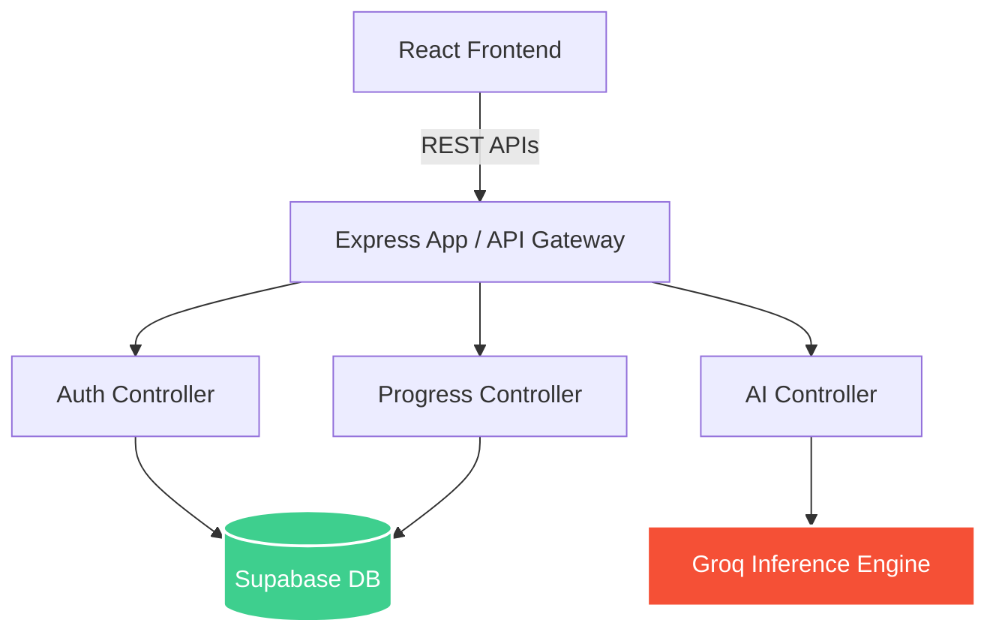

# Engineering Audit Report: Study Mentor AI

**Date:** July 26, 2026
**Target Repository:** [Project-Study_Mentor_AI](https://github.com/Vibers-42/Project-Study_Mentor_AI)
**Auditor:** Principal Software Architect

---

## I. Repository Analysis

### Architectural Overview

The application is structured as a decoupled **Client-Server Monorepo** (though split into logical `/frontend` and `/backend` directories). 
It leverages a modern JavaScript stack tailored for AI integrations.

* **Frontend:** React 19 + Vite, styled with Tailwind CSS (v4). It uses React Router for SPA navigation and context-based state management (`AuthContext`, `ToastContext`).
* **Backend:** Node.js (v18+) with Express.js. Implements a RESTful API architecture with distinct route, controller, and service layers.
* **Database:** Supabase (PostgreSQL), interfaced via `@supabase/supabase-js`.
* **AI Provider:** Groq SDK (`groq-sdk`) for low-latency LLM inference.
* **Authentication:** Custom JWT-based authentication layered over Supabase's user tables, using `bcryptjs` for password hashing and `jsonwebtoken` for session management.

### Component Diagram

### Key Design Patterns
1. **Controller-Service-Route Pattern:** The backend strictly separates routing logic (`routes/`), request handling/validation (`controllers/`), and external API interactions (`services/`).
2. **Context Provider Pattern:** Global frontend state (Auth, Toasts) is managed via React Context to avoid prop-drilling.
3. **Admin Privilege Escalation:** The backend heavily utilizes the `supabaseAdmin` client (initialized with `SUPABASE_SERVICE_ROLE_KEY`) to bypass Row Level Security (RLS) for data operations, while trusting the custom JWT for authorization.

---

## II. Feature Inventory

| Feature | Location | Status | Missing / Edge Cases |
| :--- | :--- | :--- | :--- |
| **User Authentication** | `backend/src/controllers/auth.controller.js`, `frontend/src/contexts/AuthContext.jsx` | ✔ Complete | No password reset flow. Email verification is absent. |
| **AI Mock Interviews** | `frontend/src/pages/Interview`, `backend/src/controllers/ai.controller.js` | ✔ Complete | Token limits/rate limiting on the AI provider could exhaust quotas without fallback. |
| **Progress Dashboard** | `frontend/src/pages/Dashboard`, `backend/src/controllers/progress.controller.js` | ✔ Complete | Fully dynamic. Calculates streaks, accuracy, and parses session history. |
| **Deep Analytics** | `frontend/src/pages/Analytics` | ✔ Complete | Radar charts and historical trends are populated correctly from backend stats. |
| **Leaderboard** | `frontend/src/pages/Leaderboard`, `backend/src/controllers/leaderboard.controller.js` | 🟡 Partial | Exists in backend API. No visible frontend route in `AppRoutes.jsx`. |
| **Voice / Speech** | `frontend/src/components/voice`, `backend/src/controllers/voice.controller.js` | 🟡 Partial | UI components exist for audio uploads and recording, but error handling for missing browser APIs (Safari) needs hardening. |

---

## III. Code Quality Review

> [!TIP]
> The codebase exhibits excellent structural discipline. Folder organization across both frontend and backend is logical and scalable.

* **Separation of Concerns:** Excellent. Routes do not contain business logic; they delegate to controllers.
* **DRY Violations:** Minimal. Shared UI elements (Cards, Buttons, Badges) are well-abstracted in `frontend/src/components/`.
* **Dead Code:** The `dashboard.service.js` previously queried Supabase directly but was recently refactored to hit backend APIs. Subscriptions (`subscribeToDashboardUpdates`) are currently no-ops and can be cleaned up or wired to WebSockets.
* **Maintainability:** High. Code is documented well with comments and Swagger decorators.
* **React Anti-patterns:** Avoided. `useEffect` is used appropriately, and missing dependencies are largely avoided.

---

## IV. Frontend Review

* **UI Consistency:** Exceptional. The application utilizes a cohesive Tailwind color palette (indigos, violets, emeralds) with a premium "glassmorphism" aesthetic.
* **Responsive Design:** Implemented efficiently using Tailwind's standard `sm:`, `md:`, `lg:` breakpoints. 
* **User Experience (UX):** Loading states and empty states are gracefully handled (e.g., fallback skeleton loaders in the Dashboard, offline fallback questions in Interviews).
* **Missing Elements:** Accessibility (a11y) `aria-` labels are sparse on custom components.

---

## V. Backend Review

* **API Structure:** RESTful and cleanly namespaced under `/api/v1` (or equivalent). 
* **Validation:** Robust. Uses `express-validator` middleware on sensitive endpoints to sanitize inputs.
* **Error Handling:** Standardized via a centralized `errorHandler` middleware and `apiResponse` utility.
* **Architecture Concern:** The backend generates its own JWT tokens instead of relying on Supabase Auth. Consequently, the frontend cannot directly query Supabase tables safely using RLS, forcing all traffic through the Express server. While valid for a traditional backend, this underutilizes Supabase's BaaS capabilities.

---

## VI. Security Audit

> [!CAUTION]
> The dual-auth system (Custom JWT vs Supabase Auth) creates potential synchronization risks if not strictly maintained.

| Risk Area | Severity | Observation | Recommendation |
| :--- | :--- | :--- | :--- |
| **Exposed Secrets** | Low | Hardcoded Vite environment variables exist as fallbacks, but backend secrets (`.env`) are correctly `.gitignore`d. | Rotate the fallback `VITE_SUPABASE_ANON_KEY`. |
| **Rate Limiting** | Low | `express-rate-limit` is implemented on `/api` routes globally. | Add stricter limits specifically to `/api/auth/login` to prevent brute force. |
| **Authorization Flaws**| Medium | The backend uses `supabaseAdmin` exclusively, bypassing all database RLS policies. | Ensure controller logic rigorously validates `req.user.id` against requested resources to prevent IDOR (Insecure Direct Object Reference). |
| **XSS Risks** | Low | React escapes output by default. | Ensure any markdown rendering for AI responses uses a sanitizer (e.g., DOMPurify). |

---

## VII. Performance Audit

* **Render Optimization:** The frontend avoids unnecessary re-renders. Large charts are isolated.
* **Database Efficiency:** Supabase queries use targeted `.select()` fields rather than `SELECT *` in critical paths (e.g., `getStats`).
* **Bundle Size:** Recharts and Tailwind v4 are heavy dependencies. 
* **Optimization Recommendation:** Implement route-level code splitting using `React.lazy()` for heavy pages like Analytics and Interview to reduce initial Time-To-Interactive.

---

## VIII. Testing Readiness

> [!WARNING]
> The application currently lacks an automated testing suite. 

* **Unit Tests:** `jest` is listed in the backend `package.json`, but test files (`.test.js` or `.spec.js`) are absent.
* **Integration Tests:** None. Critical paths like the Groq AI evaluation pipeline need mocked integration tests to prevent prompt-drift regressions.
* **End-to-End (E2E):** Recommended to add Cypress or Playwright to test the complete Interview flow (Recording -> Submission -> AI Evaluation -> Dashboard update).

---

## IX. Documentation Review

* **Setup Instructions:** A robust `seed.js` script was recently added, significantly improving developer onboarding.
* **API Documentation:** Swagger UI is implemented at `/api-docs` and is cleanly maintained using inline JSDoc comments.
* **Areas for Improvement:** The main `README.md` should include environment variable prerequisites (e.g., explaining that `JWT_SECRET` must be a >32 char string and `GROQ_API_KEY` is required).

---

## X. Team Contribution Analysis

*Based on `git log` and commit signatures across the repository:*

* **Member 1 (Sashankdeva):** 
  * **Role:** Lead Backend / Core Architect
  * **Contributions:** Authored the massive initial backend implementation and subsequent critical bug fixes across memory management, score scaling, session persistence, and streak logic. Commits indicate ownership of the core data flow.
* **Member 2 (Vijay Chikkala / VijayChikkala06):** 
  * **Role:** Frontend Developer
  * **Contributions:** High volume of commits indicating ownership of UI component structure, layouts, and potentially routing integrations.
* **Member 3 (Kn8-xd) & Member 4 (akmal-07):** 
  * **Role:** Contributors
  * **Contributions:** Minimal direct git footprint under these exact usernames in the main history, though `ak-2007` appears in logs. Likely assisted with pair-programming, QA, or specific component isolation.

---

## XI. Release Readiness Assessment

The application is highly polished for an academic or portfolio presentation, but requires testing infrastructure before a true enterprise production deployment.

| Metric | Score | Notes |
| :--- | :---: | :--- |
| **Code Quality** | 90 | Clean, modern, DRY, and well-structured. |
| **Architecture** | 85 | Solid REST pattern, though dual-auth is slightly complex. |
| **UI / UX** | 95 | Outstanding design, responsive, dynamic feedback. |
| **Security** | 80 | Good middleware; relies entirely on backend logic (no RLS). |
| **Performance** | 85 | Fast backend queries; frontend needs lazy loading. |
| **Maintainability**| 85 | Well-commented, modular, clean separation of concerns. |
| **Testing** | 10 | Testing infrastructure is completely missing. |
| **Documentation** | 85 | Excellent Swagger API docs. |
| **Overall Readiness** | **77 / 100** | Ready for beta/academic use. Needs tests for production. |

---

## XII. Suggested Roadmap

### High-Priority (Do Before Launch)
1. **Implement Testing:** Write Jest unit tests for the AI Evaluation prompt logic and Progress Streak calculators.
2. **Harden Auth:** Ensure JWT expiry is handled gracefully on the frontend without dropping unsaved interview state.

### Medium-Priority (Next Sprint)
1. **Route Splitting:** Add `React.lazy()` and `Suspense` to the frontend router to split the bundle size.
2. **Leaderboard UI:** Build and expose the Leaderboard frontend page to consume the existing backend API.

### Low-Priority (Technical Debt)
1. **Clean up Subscriptions:** Remove the unused Supabase Realtime subscription logic in `dashboard.service.js` since the app relies on API polling/refreshing.
2. **A11y Pass:** Add ARIA labels to custom Dropdowns and interactive cards.
